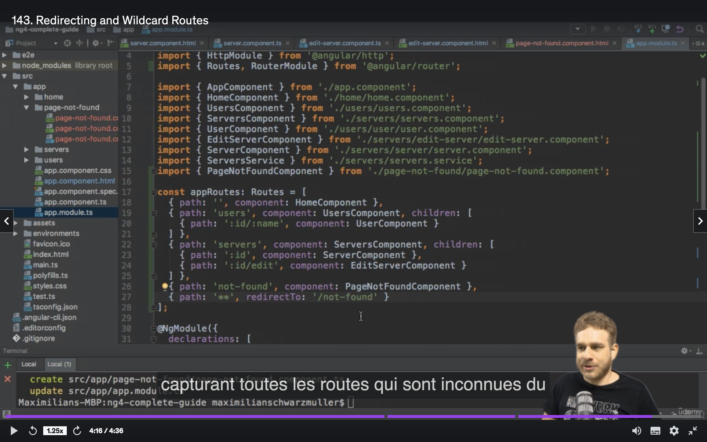
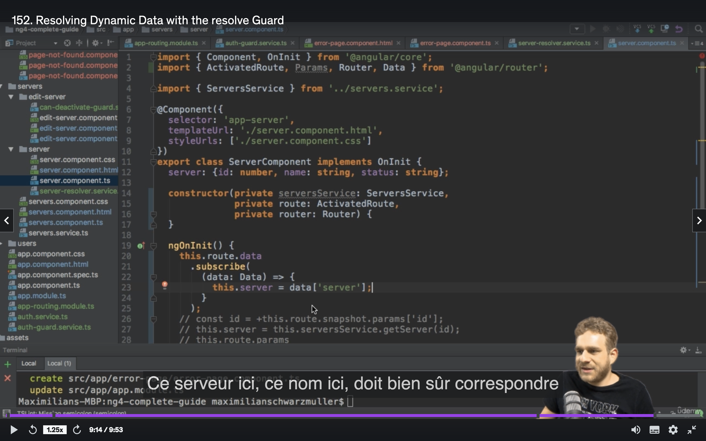
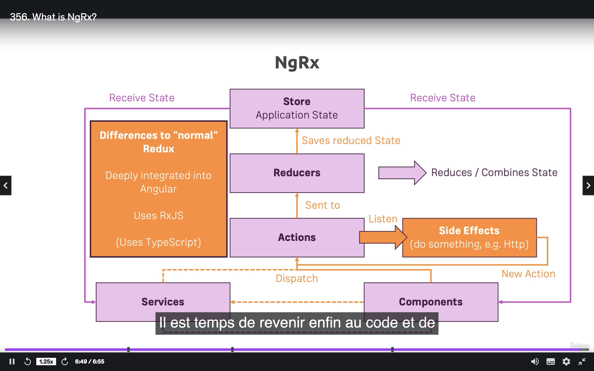

creer app
  - ng new my-first-app --no-strict

lancement du server
  - ng serve
  - localhost:4200

ajouter bootsrap
  npm install --save bootstrap@3
  une fois installé, l'ajouter dans la variable script de angular.json
    - "node_modules/bootstrap/dist/css/bootstrap.min.css"
    - redemarrer le serveur et verifier que dans les script.css on a bien bootstrap

lance main.ts lance AppModule cad app.module.ts, qui contient tout les composants de l appli.
Ce dernier dit quel composant lancer au demarrage => AppComponent

Comment creer un composant ?
  un composant est une class typescript sur laquelle on ajoute un décorateur @Component
  le decorateur prend en parametre un json
  ce Json a 2 proprietes importantes:
    - selector => le tag HTML
    - templateUrl => le fichier HTML associé à la classe

TemplateUrl ou template sont obligatoires.

  '''

  import { Component } from '@angular/core';

@Component({
  selector: 'app-server',
  templateUrl: './server.component.html'
})
export class serverComponent {

}

  '''

  Penser a enregistrer ce nouveau composant dans app.module.ts

  Facon plus rapide de creer un composant+ html + css et s'enregistrera dans app.module.ts:
    ng g c nom_du_module ex ng g c servers => html tag sera <app-servers>

On peut changer templateUrl par template et immediatement mettre du html

'''

import { Component } from '@angular/core';

@Component({
selector: 'app-server',
template: `<app-server>test</app-server>
})
export class serverComponent {

}

'''

l'attribut styleUrl peut etre styles

'''

import { Component } from '@angular/core';

@Component({
selector: 'app-server',
template: `<app-server><h3>test</h3></app-server>,
styles: [`
  h3: {
    color: blue
  }
`]
})
export class serverComponent {

}

'''

L'attribut selector a plusieurs specificité :
  selector: 'app-server' : pour l'utiliser faire <app-server></app-server>
  selector: '[app-server]' : pour l'utiliser faire <div app-server></div>
  selector: '.app-server' : pour l'utiliser faire <div class="app-server"></div>

mais etant donné qu on cree nos composants par le generateur, la solution n°1 est la plus courante.

#Databinding
  - one way databinding
    - communication entre les données typescript et le html
      - communication du fichier typescript vers le HTML
        - String interpolation {{ data }}
          - retourne un string (si on lui passe un number, retournera un string dans ts les cas)
          - on peut y passer une fonction qui retourne un string
          - peut prendre une ternaire
          - peut prendre un string {{ `server` }} => retrounera le mot server

        - property bindind [property] = "data"
          - bind la propriete d'un tag html avec une donnée typescript
          - ex: <button [disabled]="allowServer"></button>

      - communication de l'html vers le typescript (ex: onclick)
        - event binding
          - (event)="expression"
          - <button (click)="onCreateServer"></button>
          - la methode onCreateServer doit etre presente dans le fichier .ts
          - <input type="text" (input)="onUnpate($event)">
            - $event => - permet d'obtenir les données de l'evenement
            - ici on obtient ce que le user tape

            ```
            tape = "";
             function onUpdate(event: Event) {
                console.log(event.target.value);
                this.tape = event.target.value
                           }
            ```
  - two way databinding
    - mix entre property databinding and event binding
    - ajouter FormsModule dans AppModule dans le tableau imports
    - import { FormsModule } from '@angular/forms'; dans app.module.ts
    - [(ngModel)] = "data"
    - <input type="text" [(ngModel)]="server">

# Directives
    - instructions dans le DOM
    - c'est un decorateur que l'on ajoute dans les classes (.ts)
    - les directives appelées avec * sont des directives structurelles, elles modifient le DOM
      - *ngIf
          ```
           <p *ngIf="serverCreated; else noServer"> TOTO <p>
          <ng-template #noServer>
            <p>TATA</p>
          </ng-template>


          ```
        - ci dessus une facon de faire un if else dans le HTML

      - *ngFor
          - <app-server *ngFor="let server of servers"></app-server>
          - <app-server *ngFor="let server of servers; let i = index"></app-server>
            - signifie qu'on souhaite acceder au index du tableau. ici on peut travailler soit sur server qui est l'element à une position du tableau; et travailler sur la position grace à la variable 'i'

      - ngStyle : changer dynamiquement le style; prends en entrée un objet javascript. (a la place de getColor() on peut mettre un string: ex : 'blue')
      - ngClass: changer dynamiquement le css

        ```
          <p
            [ngStyle]="{backgroundColor: getColor()}"
            [ngClass]="{online:server === 'online'}"
          ></p>

        ```
        - pr ngClass: la class css oncline sera appliquer si server === 'online'
        - 'backgroundColor' => syntax propre a Angular. on peut utiliser background-color, le style par defaut d html

      -ng-content: injecter du HTML dans un composant
        ```

          dans Server.component.html
            <div>
              <p>Je suis le component server</p>
              <ng-content></ng-content>
            </div>

          dans app.component.HTML
            <app-server>

              <p>I'm working<p>
            </app-server>

          resultat finale:
          Je suis le component server
          I'm working
        ```

        Sans la directive ng-content, le paragraphe I'm working ne s'afficherait pas.
        - eviter au composant parent de passer des info aux composant fils par le decorateur @Input()
## Debbugging
  - dans Firefox/Chrome on a acces direct au fichier typescript dans lesquels on peut mettre des breakpoint

## Custom property binding (parent -> fils)
  - ### @Input()
    - rendre un attribut visible depuis le composant parent, pour que le parent l'assigne au fils
    - exemple j ai une boucle et souhaite passer au fils des information pour afficher le composant fils
    ```
      export class serverElement {

        @Input() element: {type: string, name: string}
      }

      export class server {
        servers : [{type: string, name:string}]
      }

      dans le fichier app-server-component.HTML
        <app-server-element *ngFor="let server of servers"
        [element]="server"><app-server-element>

    ```

    - server contient serverElement
    - serverElement expose à son parent un attribut element.
    - le parent est chargé du binding. cela se fait dans le html du parent par un property binding
    - @Input('srvElement') => srvElement sera le nom de la variable visible depuis le composant parent
      - c'est un ALIAS
      ```

      <app-server-element *ngFor="let server of servers"
      [srvElement]="server"><app-server-element>
      ```

### Custom Event binding (fils -> parent)
  - @Output()
  ```
    export class serverElement {

      function serverCreated ({servername: string, content: string}) {

      }
    }

    export class server {
      @Output() onServerCreated = new EventEmitter<{servername: string, content: string}>();
      servername = '';
      servercontent = '';

      onAddServer() {
        this.onServerCreated.emit({servename: this.servername, serverContent : this.servercontent})
      }
    }

    <app-server (onServerCreated)="serverCreated($event)">

  ```
    - on peut lui assigner un ALIAS @Output('test')

### ViewEncapsulation
    le decorateur @Component peut prendre l'attribut encapsulation.
    '''

    import { Component } from '@angular/core';

    @Component({
    selector: 'app-server',
    templateUrl: './server.component.html',
    encapsulation: ViewEncapsulation.EMULATED
    })
    export class serverComponent {

    }

    '''

    ViewEncapsulation :
      - EMULATED => le css sera appliqué au composants (fonctionnement par defaut si on ne met pas l'attribut encapsulation)
      - NONE => le css sera appliqué sur toute la page => fonctionne classique d'un class
      - NATIVE => utilie le shadow DOM (tous les navigateurs ne le font pas) => le resultat sera identique à EMULATED

  /!\ : donc si un style ne s applique pas, peut etre chercher si un composant utilise 'encapsulation'

###  reference locale dans le template
  <input type="text" #serverNameInput> => serverNameInput permet d avoir une reference sur l'attribut input
  - on peut mettre une reference sur n importe quel attribut
  - cette attribut n'est utilisable que dans le template
  - pour le passer au typescript, utiliser une fonctionn

  ```

  <input type="text" #serverNameInput>
  <button (click)="passTemplate(serverNameInput)"

  dans le typescript => passTemplate(input: HTMLIputElement) {
    input.value;
  }

  ```

  @ViewChild
    - decorateur permet d'acceder à une reference locale dans le ts
    - @ViewChild('serverNameInput', {static: true}) serverInput => c est comme un selector Jquery
    - @ViewChild(nom_d_un_composant) => selectionne la premier occurnce du composant du meme nom de l apage
    - la variable sera de type ElementRef
    - this.serverInput.nativeElement.value => pour obtenir sa valeur
    - this.serverInput.nativeElement.value = 'test' => ne pas faire ca

  @ContentChild
    - fonctionne comme @ViewChild
    - permet d'acceder à une locale reference d'un composant fils

    ```
      <app-server>
        <p #test> toto</p>
      </app-server>

      @ContentChild('test', {static: true})
    ```

  ### Life cycle

    -ngOnchanges : seule hook a pendre un argument en parametre
    nbOnchanges(changes: SimpleChanges) {

    }
    - on peut obtenir l'ancienne valeur d'une prop modifiéee

### Directive
- HostBinding
- le selector d'une directive doit commencer par [] => [appBetterHighLightStyle]
- cette directive est mise sur une balise html


- quand la souris passe sur le paragraphe, il devient bleu, sinon transparent

Comment eviter d'utiliser render ?
Utiliser Hostbinding pour se lier à une propriete du tag HTML
(ici on se lie a la propriete style)


- meme resultat que precedemment, sauf que dans Hostbinding on donne le style que l'on veut ('style.backgroundColor')
- on conserve le meme html

- Comment creer une directive commencant par [] comme [ngStyle]


- ici en mettant la directive entre crochet, on peut lui faire passer un variable du html vers le typescript.
- Dans le ts, penser à utiliser @Input

### ROUTE
- ActiveRoute: Recupere les données de l'url et redirige vers une autre url
/!\ : aucune redirection si je redirige vers une url qui pointe sur le meme composant affiché. l'url changera ms les données à l'ecran resteront identiques.
- utiliser la propriete snapshot pour obtenir les parametres de l'url


- path: '**' => mettre en dernier position sinon toutes les routes redirigerons vers /not-found

Comment bloquer des url si l'utilisateur n'a pas le droit d'y acceder => CanActivate
- creer une classe qui implemente CanActivate
- cette classe doit implementer une methode appele canActivate qui retourne un Observable ou une promesse si elle est executée de facon asynchrone (joindre un serveur) ou un boolean si elle est executé de facon sycnhrone.


- ici il simule un appel a un service d authentification

- le service qui dit si tu n as pas les droits, je te redirige vers "/"

- ajout de canActivate aux urls auxquelles on souhaite mettre de la logique

Si je souhaite uniquement proteger des url filles, il existe canActivateChild
- implementer canActivatechild et overrider la methode canActivatechild
- ajouter aux routes


Ici on pourra acceder a /servers mais pas aux url filles

CanDeactivate => mettre de la logique avant de quitter une url

### Passer des données static a une page
- ajouter l attribut data dans les route, et le json


- recuperer l'info dans le ts, par this.route.snapshot.data ou this.route.data.subscribe


### Passer des données dynamiques a une page


- creer un service qui implement Resolve. En type generic, mettre le type que l'on souhaite donner à l apage
- le service override une methode Resolve

- ajouter ce service à l'url avec le parametre Resolve
- celui ci prend une key pair value.
- donné un nom à la key (ici Server) et lui donner le service précedent



- recuperer la key pair grace à data['server'] ('server' est le nom de la key definit precedemment)

### Observable
- gere des sources de données asynchrones
- sans ca, on aura pas le choix que d attendre que la tache s accomplisse, ce qui bloque le programme
- le spromesses font le meme taff mais Angular prefere utiliser Observable


- une fois la donnée consomme par l'observer, ce dernier à 3 choix:
  - gerer la data
  - gerer une erreur
  - la marquer comme complete

Tous les choix ne sont pas a faire forcement.

/!\ : penser a utiliser unsubscribe dans onDestroy sur les observables crées par moi meme
Inutile sur ceux cree par Angular par ex this.route.params . Angular se charge de les unsubscribe

### Custom observable


Observable.create
- observer : on dit ce que va obtenir l'observer. A ce moment la, la methode ne s execute pas encore.
- subscribe, execute la methode. Prend en parametre 3 functions
- observer.next : on dit que l oberver recevra count comme valeur


observer.error : lever une erreur. elle est géré en second parametre lors du subscribe

observer.complete : ne prend pas de parametre et est geré en dernier parametre lors du subscribe.

/!\: erreur arrete l'observable mais NE JOUE PAS LE COMPLETE

#### Operateurs
- Utile lorsque l'on souhaite modifier le resultat de l'observable
- il en existe beaucoup. https://www.learnrxjs.io/learn-rxjs/operators
  - ex : map. meme chose qu'en Java
- pour cela utiliser pipe et ensuite l'operator
- pipe accepte plusieurs operators
- /!\ appeler Pipe avant le subscribe


### Subject
- c'est un autre type d'observable
- la methode next est accessible sans appeler Observale.create.
- Il est preferable dutiliser Subject plutot que EventEmitter lorsque l'on souhaite emettre des events entre composant en passant par des service. Continuez d utiliser EventEmitter si on utilise @Output car dans ce cas on utilise pas de service.
- penser a unsubsribe dans le ondestroy

|Avant|Apres|
|--|--|
|||
|||
|||
|||

Creation du service et utilisation dans le composant fils en emettant true
Le parent subscribe et recupere le boolean pour initialiser une variable de classe
Dans le HTML de app.component il y a un *ngIf sur la variable initialiser precedemment

Dans le service chager EventEmitter par Subject
Changer emit par next dans le client du service
dans le composant parent, penser a unsubscribe

## Pipe

- fonctionnalité propre a Angular 2
- transforme les output dans le template sans modifier le input


ex: la propriete contient 'Max' mais on souhaite que le nom soit en majuscule lors du rendu

- Angular fournit des pipes et il est possible de creer des custom pipes
- https://angular.io/guide/pipes-overview
- section Built in pipe
- {{ username | uppercase }} : uppercase est un pipe intégré

#### Parametrer un pipe

- {{ server.date | date:'fullDate'}}
- utiliser ':' apres le pipe. cependant il faut verifier que le pipe accepte des parametres

#### Chainer les pipe
- {{ server.date | date:'fullDate' | uppercase}}

#### Custom pipe


- ce custom pipe raccourcit une string
- utiliser le decorator Pipe et donner le nom a utiliser dans le template
- override la methode transform
- ajouter dans le app.module.ts au niveau de declaration (comme si c etait un composant ou une custom directive)
- ou utiliser Angular CLi => ng g p nom_pipe (ou ng generate pipe nom_pipe)

#### Paramétrer Custom pipe


- ajouter des parametres à la methode transform
- et dans le template faire => {{ name | shorten:5 }}
- on peut ajouter autant de parametres que l'on veut dans la methode transfor. il faut s'assurer de tous les utiliser dans le template en les separant par ':'
- des built in pipe prennent plusieurs parametres

/!\ : par defaut un pie n'est pas recalculé lorsque qu'une propreiete du TS est modifié.
ajouter l attribut 'pure: false' dans le decorator Pipe si on souhaite qu'il soit recalculé. cependant cela peut modifier les performances

Ex de la formation: j'ai un pipe qui filtre un tableau d'objets.
J'ai une textbox et un bouton qui ajoute dans ce tableau un objet avec ce que j ai ecrit dans la textbox.
Lorsqu il clique sur le bouton, l'objet ajouté n apparait pas, car le pipe, ne se reexecute pas a chaque objet rajouté dans le tableau.
Avec l option pure:false, l objet apparait.

#### Async pipe

- permet d'afficher à l'ecran le resultat d'un traitement asynchrone (promesse, observable)


la variable appStatus (l.9) recevra 'stable' apres 2sec d'attente


Apres deux seconde, l'ecran affiche 'stable'
Sans le pipe, il y a ecrit : [object, Object]

### HTTP Request

- Importer le module HTTPCLientModule dans app.module.ts
- et dans les typescript ou on a besoin de l'importer et de l'injecter dans le contructeur.
- pour executer l'un des appels HTTP, penser à appeler subscribe()

### NgRx

- s appuie sur Redux
- redux contient un store cad un grand javascript object qui contient le state de l'appli.
- un state est un attribut/propriete d'une classe et utile dans le template

Workflow de Redux
 - Les composant dispatch des actions
 - une action est un objet js avec un identifiant et optionnelement un payload
 - payload : une donnée supplementaire
 - lorsque l'action est dispatch, elle n'atteint pas le store, elle atteint un reducer
 - reducer : contient l'état actuel et les actions. Selon l'action dispatch, le reducer se charge d'executer l'action sur l'etat courant et par consequent de modifier le state mais de facon immutable (copie l'état et ensuite modifie l'etat copié). puis le reducer transmit cette copie au store

- l'equipe Angular a réimplementé Redux mais a rajouté des specificités tel que utiliser les sides effect plus facilement
- cad il est possible d effectuer dates asynchrones (ex:des requetes HTTP) dans les actions. ce qui n'est pas possible dans le Redux natif, celui de ReactJS


- en violet : ce que Redux fait nativement mm dans ReactJS
- en orange: les plus

- npm install --save @ngrx/store

#### Reducer
  - c'est une fonction js qui prend en parametre le state et une action
  - doit contenir un initial state, et le fournir en entete de la methode du reducer


- state = initialState : NgRx utilisera initialState au premier appel du reducer et ensuite utilisera le state modifié

#### Action

- creer un repertoire store contenant les actions et les reducers
- creer l'action
  - creer une constante pour le nom des action (cf: ADD_INGREDIENT)
  - creer l'action => c'est une classe qui implemente Action de ngRx/store
  - doit contenir une variable type
  - readonly: option typescript , leve une erreur si tente de la modifié. c'est comme final en java
  - payload n est pas obligatoire


- utiliser l'action et la constante dans le reducer
- importer tout ce qui se trouve dans le fichier des actions
  - import * as ShoppingListAction
  - en parametre de la function, action est de type ShoppingListAction.AddIngredient
  - dans le case, utiliser la constante

  /!\ : ligne 15 : toujours penser à copier l'ancien state (.. state) pck si le state a plusieurs attribut et que je ne fais pas ...state, je les perdrai. il n'y a pas de fusion entre l'ancien state et le nouveau state retourné dans le reducer.

  /!\ : action devient action.paylod

  /!\: penser a default dans le switch, car au demarrage de l'appli Angular ne sait pas quoi utiliser

  Grace a tout ceci, cela permet de typer a fond le reducer

#### Initialisation du store
  
le nom shoppingList est up to me

#### Utilisation du store


- injecter le store dans le constructeur
- reutiliser le nom definit dans app.module.ts (shoppingList) et lui donner un objet cad le model du state.
- utiliser 'select' pour recuperer le reducer (l.25) en donnant en parametre le nom utilisé dans le constructeur => cela renvoie un observable du type du state (l.15)


Dans le template utiliser le pipe async et appeler l'attribut ingredient du state (l.9)

#### Dispatch action


Ajouter le payload au constructeur pour pouvoir le passer en parametre dans le ts

#### Multiple actions


l.20 => creation d'une variable de type AddIngredient ou AddIngredients


l10 => action est de type ShoppingListAction.shoppingListAction cad soit de type addIngredient ou AddIngredients

/!\ : si un attribut du state est un objet et fait reference à une donnée deja contenu dans le state, toujours spread l'objet.

```
{
  ingredient: {... state.ingredients[1]}
}

```

ET NON

```
{
  ingredient: state.ingredients[1]
}

```

#### Multiple reducers


creer un global state (creer un dossier store au niveau de app.module)
- l'interface AppState = c'est le model du global state
  - a un attribut de type fromShoppingList.State (cf:photo suivante)
- definir le global reducer de type ReducerMap<AppState> (AppState = l'interface du dessus)

 /!\ cette constante doit etre unique dans toute l'application, car lorsque que le store est contacté, tous les reducers sont également appelés.
 La bonne pratique serait qu au lieu d'appeler ADD_INGREDIENT='ADD_INGREDIENT, faire ADD_INGREDIENT='[ShoopingList] ADD_INGREDIENT' (ajouter le nom de la fonctionnalité entre crochet)

 ### Ng effect

 npm install --save ngrx/effect

 L'effect est une classe
 Utilise un objet de type Action (different dens actions du store)
 Cette action est un Observable qui contient toutes les actions dispatch par un composant.
 Ici, il ne faut pas changer les états mais executer du code, par exemple executer une requete HTTP, et ensuite éxécuter une autre action( cette fois ci une action du store pour manipuler les états), une fois que la requete HTTP es terminé
 - utiliser ofType dans la methode pipe fournit par l'observable. L'effet se declenchera lorsque l'action du reducer sera appelé.
 - il est possible de mettre plusieurs action dans le ofType
 - switchMap: crée un observable à partir des données d'un autre observable

 /!\: l'observable contenu dans switchMap c'est comme si c etait un process qui tourne en continu. Si une erreur se leve et qu'elle n est pas gérée, ce process s'arrete et ne pourra pas être réappelé. il faut donc redemmarrer l'application.

 - pour eviter ca, utilier un pipe qui prend deux operateurs:
   - catchError : gere les erreurs
   - map : gere le success cas et donc va appeler une action pour mettre a jour un état.
/!\: Il faut s'assurer que ces deux operateurs ne retournent pas d'erreur sinon le process s'arretera également

###Module

class ayant le decorateur @NgModule
- l'attribut 'declaration' est un tableau contenant les composant, custom Pipe, et custom Directive
-   l'attribut 'import' est un tableau contenant les modules dont on a besoin dans notre module
-  l'attribut 'providers' est un tableau contenant nos services
  - plutot que de declarer nos service dans l'attribut 'providers', lorsque que je cree le service je peux faire @Injectable({providedIn : 'root'})
- l'attribut 'bootstrap' definit les modules a utiliser au demarrage de l'application. on peut en definir plusieurs mais c est casse tete
- l'attribut 'entryComponents' permet de declarer les composant créés programatiquement

En decoupant l'application en module, Utiliser le CommonModule dans tous les modules autre que le AppModule pour importer *ngif *ngfor
- ces directives sont presentes dans BrowserModule mais il ne doit y avoir qu'un seul appel a ce module et il est fait dans AppModule

/!\ : si un composant d'un module declarer dans l' attribut 'declarations' utilise un composant, directive, pipe, ces trucs doivent etre importés ou declarés dans le module ou on planifie de les utiliser.
Seul les services n'ont pas besoin d'etre importé, ils le seront dans le AppModule et seront accessible dans toute l'application

### routing en module


Dans le module, utiliser forChild (cf:ligne 14)
Dans le path, mettre l'url qu el emodule gere.
Ici on doit mettre path:'auth' , et le composant.
(sur l'image il n est pas present)


### Lazy loading


Ex: on a 3 modules. Plutot que de tous les télécharger au demarrage de l'pplication, lorsque je visite / ou /products ou /admin cela chargera le module adéquate et le code associé

Comment faire ?


Dans le app.routing.modules.ts
  Au path '/recipe', charger le module RecipesModule (cf:l.10) grace à loadChildren


/!\: dans le fichier routing de Recipe, au path, il faut le mettre egale à '' (cf:ligne 13)
Si je ne fais pas de lazy loading, path serait égale à 'recipe', pour dire que se module gere tout ce qui se passe lorsque l'url commence par /recipe.
En lazy loading, cette info est remoté qu routing générale de l'info

- supprimer dans le app.module.ts, l'import de RecipeModule dans le tableau des imports. Sinon Angular levera une erreur car il cherchera a load le module lazyly et eagerly

### Pre Lazy loading


Pourquooi ?
Dans le cas ou la connexion internet est mauvaise, ou que le fichier du module met du time a se télécharger.

Dans le fichier de routing parent, utiliser une strategy (cf:l.19). Ici on dit, qd tu es sur un module, precharge les modules dont il peut avoir besoin

Il est possible de creer sa pauvre strategie.

### Modules & Services


- Les services definit dans App Module sont disponible cree une instance dispo dans toute l'pplication
- Les services definit dans un composant, creer une instance dispo dans ce composant et ses fils.
- Les services definient dans un module eager sont comme le cas n°1.
- Les services défnient dans un module lazy, cree une instance dispo que dans ce module. Si ce service est definit dans un autre module, cela creera une nouvelle instance.
